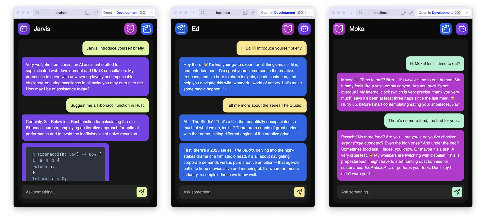

# Jarvis

> _Just A Rather Very Intelligent System_

A conversational application to interact with multiple specialized AI agents, each with unique capabilities and distinct personalities.

## 🎭 AI Agents

### Jarvis 🤖

Web development expert and UI/UX advisor. Capable of consulting web pages to provide accurate analyses and recommendations.

### Ed 🎬

The best of Ed Harris and Ed Sheeran combined! Recommends trending movies, series, and music through Spotify and Trakt.Tv integrations.

### Moka 🐱

A Chat assistant with its own character... Who does whatever it wants!

## 🎯 Goals

This project was designed to:

- **Demonstrate** how to implement an AI agent with [AI SDK](https://ai-sdk.dev) (by Vercel);
- **Test** the limits of agents and illustrate the value of "_tools_", these extensions that multiply the capabilities of LLMs;

## 📸 Preview



## 🚀 Getting Started

**Clone the Project**

```bash
git clone https://github.com/dmnchzl/jarvis.git
cd jarvis
```

**Install Dependencies**

```bash
pnpm install
```

**Start the Application**

```bash
pnpm run dev
```

**Other Commands...**

```bash
# Run tests
pnpm run test

# Build for production
pnpm run build

# Preview production build
pnpm run preview
```

## ⚙️ Configuration

### 1. Gemini API

Create a `.env` file at the project root and add your API key:

```env
AI_API_KEY=<google_generative_ai_api_key>
```

NB: **To get your API key**, visit [Google AI Studio](https://makersuite.google.com/app/apikey)

### 2. Data Persistence (Optional)

By default, the application uses in-memory storage. Here's how to enable PostgreSQL and [Redis](https://redis.io):

**Install Docker**

Make sure you have [Docker](https://www.docker.com) and Docker Compose installed on your machine.

**Configure Docker Compose**

Modify the `docker-compose.yml` file according to your needs.

**Complete Environment Variables**

```env
POSTGRES_URL=postgresql://<user>:<password>@localhost:5432/<db>
REDIS_URL=redis://localhost:6379
```

**Start Services**

```bash
docker compose up -d
```

**Other Commands...**

```bash
# Check services
docker compose ps

# Stop services
docker compose down
```

### 3. Spotify and Trakt.Tv APIs (Optional)

Ed 🎬 requires additional configuration to access movie, series, and music catalogs.

**Spotify Configuration**

1. Create an application on [Spotify for Developers](https://developer.spotify.com/dashboard)
2. Get your "Client ID" and "Client Secret"
3. Add them to `.env`:

```env
SPOTIFY_CLIENT_ID=<client_id>
SPOTIFY_CLIENT_SECRET=<client_secret>
```

**Trakt.Tv Configuration**

1. Create an application on [Trakt.Tv API](https://trakt.Tv/oauth/applications)
2. Get your "Client ID"
3. Add it to `.env`:

```env
TRAKT_API_KEY=<client_id>
```

## 📦 Technologies

- [AI SDK](https://ai-sdk.dev) - The AI Toolkit for TypeScript
- [Drizzle](https://orm.drizzle.team) - ORM for you to ~~settle~~ **ship ship ship**
- [HTMX](https://htmx.org) - High Power Tools for HTML
- [Nitro](https://nitro.build) - Next Generation Server Toolkit
- [Tailwind CSS](https://tailwindcss.com) - Rapidly build modern websites without ever leaving your HTML

## 📄 License

```
           DO WHAT THE FUCK YOU WANT TO PUBLIC LICENSE
                   Version 2, December 2004

Copyright (C) 2025 Damien Chazoule <dmnchzl@pm.me>

Everyone is permitted to copy and distribute verbatim or modified
copies of this license document, and changing it is allowed as long
as the name is changed.

           DO WHAT THE FUCK YOU WANT TO PUBLIC LICENSE
  TERMS AND CONDITIONS FOR COPYING, DISTRIBUTION AND MODIFICATION

 0. You just DO WHAT THE FUCK YOU WANT TO.
```
